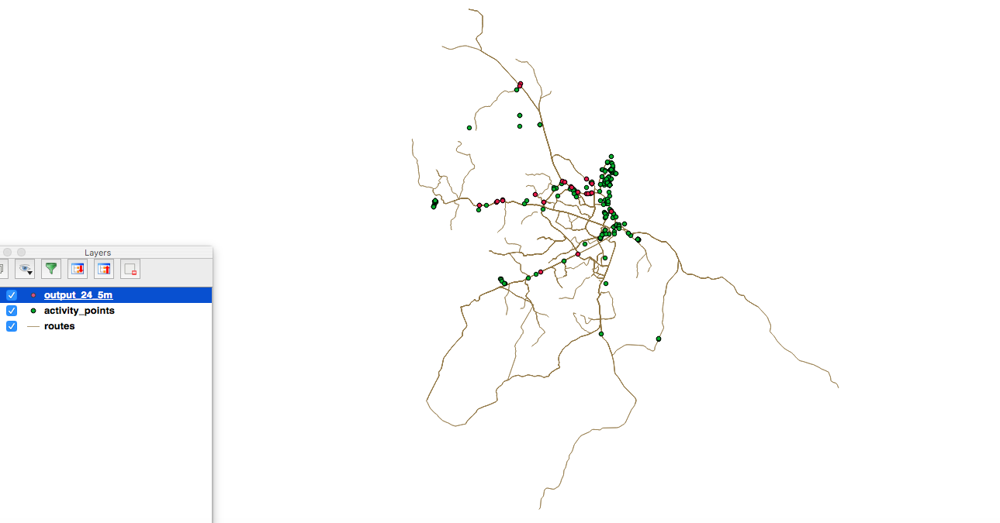
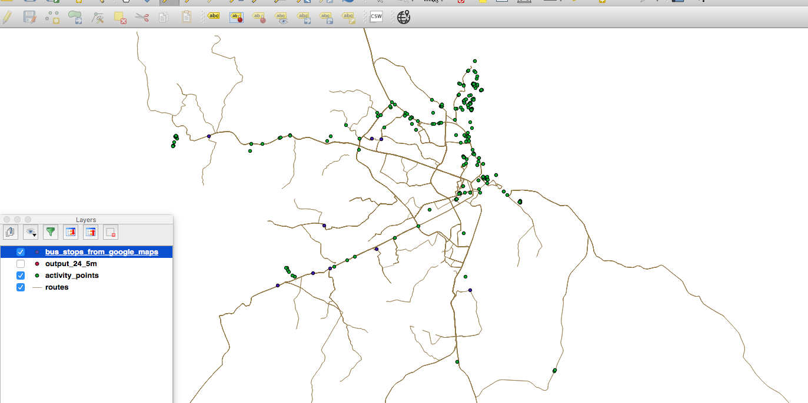

**Question: **

The file [activity_points.geojson](https://github.com/allyapp/gis-code-challenge/blob/master/data/activity_points.geojson) contains crowdsourced locations in Dar es Salaam, Tanzania. The quality and the source of the data is unknown. Not all attributes of the data always contain a value. There is no additional metadata.

Imagine you are a Software Developer at Door2Door and you are presented that data. Your task is to derive bus stop locations from the data.

##### **1. Develop an algorithm in Python that processes the data.**

##### **2. Visualise your results in a web map.**

##### **Hints:**

* You may use the provided bus routes GeoJSON file as well as additional external data to verify your results or to train your algorithm.

* You may ask one question during the code challenge about the data. However, be prepared that there is little extra information about the data available.

**Solution:**

**	**We have points(X,Y) and routes as Linestrings[(X,Y)]. Let us explore the possibilities for P being a bus stop. For the sake of this document we’ll refer to P as Point(X,Y) and Way as Route(A,B).

  The sequence of steps(Algorithm) we followed to extract the bus stops are the following:

1. Filter all the activity points based on their Previous activity, Current Activity, their respective confidence attributes, speed and accuracy.

 

2. Remove all the features(points) which are not intersecting with routes. Buffer the point around 10m and check the intersections(I have used OGR python library for buffering and intersections) -- We can optimize this step.

3.  Re-filter the points based on their attributes again.

### 	

### Knowledge & Insights from data:

		Added all the vector data files(routes.json, activity_points.json and results.json from running above Algorithm) as vector layers in QGIS. Dots represented in Red color are the output from algorithm and green represents activity points. 

	

         Also I have exported Dar ee salam busstops information from Goolge Maps as kml and converted into geojson. Added it as a layer to check the correlation between activity points and actual bus stops. Unfortunately I can not see any activity point(387) coincide with actual bus stops(10) from Google.

 

